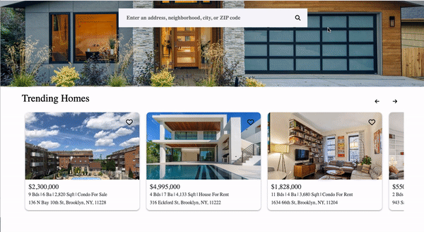
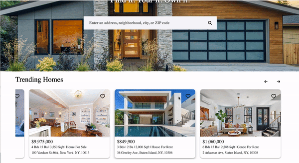

# WELCOME TO FINDMI

Check out the [Live Site](https://findmi.onrender.com) here!

## Introduction

  FindMi is a clone of the Zillow website. Zillow is a homes listing website for users to post houses/apartments for sale/rent. A Zillow user can browse and search listings on the site without creating a user profile; however, an account is required for the user to post their own properties for sale or rent on Zillow. Zillow also provides a interactive map using Google Map API and the ability to save/favorite listings so you can come back and review listings that you are interested in. The technologies used to create FindMi include:

* Languages: Javascript, Ruby, HTML, and CSS
* Asset Storage: AWS Simple Cloud Storage
* Hosting: Render
* Database: PostgreSQL
* Frontend: React-Redux
* Libraries: Google Map Javascript API

# MVPs 

## User Account

A FindMi user can create account using an email and password.  The user account created will persist in the backend and the user can re-use the account during re-login:


### Login

```
    return (
        <>
            <form className="loginForm"onSubmit={handleSubmit}>
                <label className='lFormLabel'>
                    Email
                    <br/>
                    <input
                        className='lFormInput'
                        type = "text"
                        placeholder='Enter email'
                        value = {email}
                        onChange={(e) => setEmail(e.target.value)}
                        />
                </label>
                <label className='lFormLabel'>
                    Password
                    <br/>
                    <input 
                        className='lFormInput'
                        type = "password"
                        placeholder='Enter password'
                        value = {password}
                        onChange={(e) => setPassword(e.target.value)}
                        />
                </label>
                <button className="lFormButton" type="submit">Sign In</button>
                <input className="lFormButton" type="submit" onClick={demoUser} value="Demo User"/>
                <ul className='errors'>
                    {errors.map(error =><li key={error}>{error}</li>)}
                </ul>
            </form>
        </>
    );

```

### Sign Up

```
    return (
        <form className="signUpForm" onSubmit={handleSubmit}>
            <label className='sFormLabel'>
                Email
                <br/>
                <input 
                    className='sFormInput'
                    type="text"
                    placeholder='Enter email'
                    value={email}
                    onChange={(e) => setEmail(e.target.value)}
                    />
            </label>
            <label className='sFormLabel'>
                Password
                <br/>
                <input 
                    className='sFormInput'
                    type="password"
                    placeholder='Create password'
                    value={password}
                    onChange={(e) => setPassword(e.target.value)}
                    />
            </label>
            <label className='sFormLabel'>
                Confirm Password
                <br/>
                <input 
                    className='sFormInput'
                    type="password"
                    placeholder='Confirm password'
                    value={confirmPassword}
                    onChange={(e) => setConfirmPassword(e.target.value)}
                    />
            </label>
            <button className="sFormButton" type="submit">Sign Up</button>
            <ul className='errors'>
                {errors.map(error => <li key={error}>{error}</li>)}
            </ul>
        </form>
    )
```

## Browse Listings 

User can start off browsing the listings on the splash page or click on the Buy button to generate a Google Map with markers to show the location of all the listings available: 


```
    return (
            <li className="cardDiv" 
                onClick={() => history.push(`show/${id}`)}
            >
                    <div className="card"> 
                        <div id="cardPic" className="cardTop" style={{ 
                            backgroundImage: `url(${photosUrl[0]})` 
                            }}>
                            {/* {pictures} */}
                            <FavButton sessionUser={sessionUser} listing={listing} favorites={favorites}/>
                        </div>
                        <div className="cardBottom">
                            <div className="cardPrice">
                                ${price.toLocaleString('en-US')}
                            </div>
                            <div className="cardInfo">
                                {bedrooms} bds |&nbsp;
                                {bathrooms} ba |&nbsp;
                                {sqft.toLocaleString('en-US')} sqft |&nbsp;
                                {text} for {listingType}
                            </div>
                            <div className="cardAddress">
                                {address}
                            </div>
                        </div>
                    </div>
            </li>
    )

```

A user can also browse listings that they created and also listings that were favorited:  


```
    return (
            <li className="YC_cardDiv" 
                onClick={() => history.replace(`/show/${id}`)}
            >
                    <div className="card"> 
                        <div className="cardTop">
                            {pictures}
                        </div>
                        <div className="cardBottom">
                            <div className="cardPrice">
                                ${price.toLocaleString('en-US')}
                            </div>
                            <div className="cardInfo">
                                {bedrooms} bds |&nbsp;
                                {bathrooms} ba |&nbsp;
                                {sqft.toLocaleString('en-US')} sqft |&nbsp;
                                {text} for {listingType}
                            </div>
                            <div className="cardAddress">
                                {address}
                            </div>
                        </div>
                    </div>
            </li>
    )

```

## Show Listing

User can click on a particular listing to show more information about the property:  



```
    return (
            <> 
                <div className="showDiv">
                    <div className="showLeft">
                        {pictures}
                    </div>
                    <div className="showRight">
                        <div className="infoHeader">
                            
                            <div className="showButtons">
                                <button>
                                    <i className="fa-regular fa-heart"></i> &nbsp;Save
                                </button>
                                <button>
                                    <i className="fa-solid fa-share"></i> &nbsp;Share
                                </button>
                                <button>
                                    <i className="fa-regular fa-eye-slash"></i> &nbsp;Hide
                                </button>
                                <button>
                                    <i className="fa-solid fa-caret-down"></i> &nbsp;More
                                </button>
                            </div>
                        </div>
                        <div className="showPriceInfo">
                                <div className="showPrice">
                                    ${price.toLocaleString('en-US')}
                                </div>
                                <div className="showInfo">
                                    {bedrooms} bds |&nbsp;
                                    {bathrooms} ba |&nbsp;
                                    {sqft.toLocaleString('en-US')} sqft
                                </div>
                        </div>
                        <div className="showAddress">
                            {address}
                        </div>
                        <div className="showListingType">
                            <div className="showType">
                                <i className="fa-solid fa-circle"></i>
                            </div>
                            <p>For {listingType}</p>
                            <p>FindMiMate : None</p>
                        </div>
                        <div className="showTourAgent">
                            <button className="tourButton">
                                Request a Tour
                                <p>as early as tomorrow at 11:00am</p>
                            </button>
                            <button className="agentButton">Contact an agent</button>
                        </div>
                        <div className="showScroll">
                            <div className="sOverviewDiv">
                                <ul className="showOverview">
                                    <li key="houseType"><i className="fa-regular fa-building"></i> {houseType}</li>
                                    <li key="yearBuilt"><i className="fa-regular fa-calendar"></i> Built in {yearBuilt}</li>
                                    <li key="monthly"><i className="fa-solid fa-hand-holding-dollar"></i> {monthly}</li>
                                    <li key="airCond"><i className="fa-regular fa-snowflake"></i> {airCond}</li>
                                    <li key="parking"><i className="fa-solid fa-square-parking"></i> {parking}</li>
                                </ul>
                            </div>
                            <div className="showDescription">
                                <h2 className="sDescription">Description:</h2>
                                <p className="sDetails">{overview}. {description}</p>
                            </div>
                            <div className="edit_delete">
                                {editButton}
                                {deleteButton}
                            </div>
                        </div>
                    </div>
                </div>
            </>
        )
    
```

## Favorites

A user can click on each listing to save them to their favorites section for future review:  



```
function FavButton({listing, sessionUser, favorites}) {
    // const favorites = useSelector(getFavorites)
    const dispatch = useDispatch();
    
    const listingId = String(listing.id)
    let userId;
    if (sessionUser) {
        userId = sessionUser.id
    };
    
    let favoriteId;
    if (Object.keys(favorites).includes(String(listing.id))) {
        favoriteId = favorites[String(listingId)].id
    } 

    useEffect(() => {
        if (sessionUser){
            dispatch(fetchFavorites())
        }
    }, [dispatch, favoriteId])

    const handleCreateFav = (e) => {
        e.preventDefault(); 
        e.stopPropagation();
        const formData = new FormData();
        formData.append("favorite[saverId]", userId)
        formData.append("favorite[listingId]", listing.id)
        return dispatch(setupFav(formData))
    }

    const handleDeleteFav = (e) => {
        e.preventDefault(); 
        e.stopPropagation();
        return dispatch(deleteFav(favoriteId))
    }

    let showFavType;
    if (!sessionUser || !Object.keys(favorites).includes(String(listing.id))){
        showFavType = <button className="favButton" type='submit' onClick={handleCreateFav}><i className="fa-regular fa-heart"></i></button>
    } else {
        showFavType = <button className="favButton" type='submit' onClick={handleDeleteFav}><i className="fa-solid fa-heart"></i></button>
    }
    

    return (
        <>
            {showFavType}
        </>
    )
}
```

### Thanks 

FindMi was created in a 2 weeks timeframe, thank you for your visit!